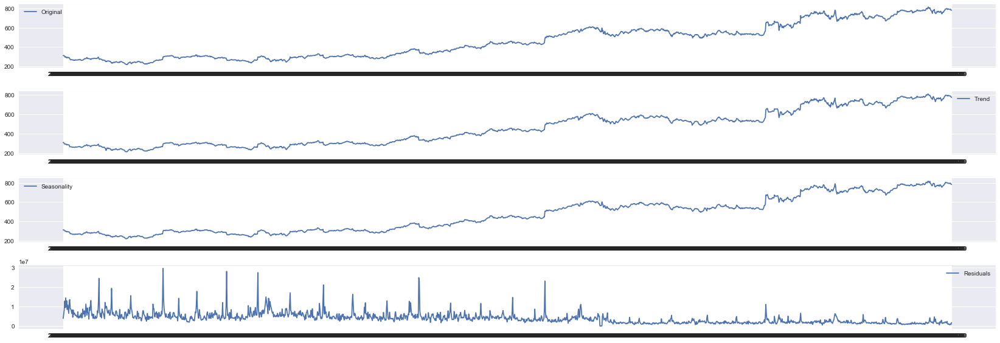
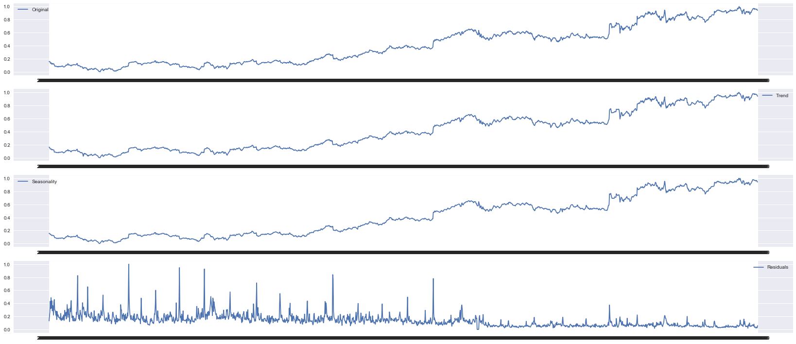
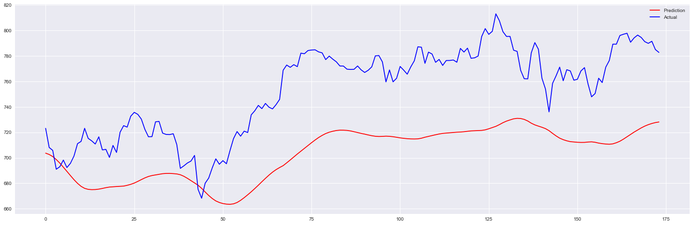

[Research Paper of Stock Prediction of NYSE](http://cs229.stanford.edu/proj2012/BernalFokPidaparthi-FinancialMarketTimeSeriesPredictionwithRecurrentNeural.pdf)  
Learn More Technique for this project [Click on Here](https://github.com/BenjiKCF/Neural-Network-with-Financial-Time-Series-Data)

This dataset is a playground for fundamental and technical analysis. It is said that **30% of traffic on stocks** is already generated by **machines**, can trading be fully automated? If not, there is still a lot to learn from historical data.


```python
import numpy as np
import matplotlib.pyplot as plt
import pandas as pd
from pandas import datetime
import math, time
import itertools
from sklearn import preprocessing
import datetime
from operator import itemgetter
from sklearn.metrics import mean_squared_error
from math import sqrt
from keras.models import Sequential
from keras.layers.core import Dense, Dropout, Activation
from keras.layers.recurrent import LSTM
from keras.models import load_model
import keras
import h5py
import requests
import os
import seaborn as sns
sns.set()
```

**Read data and transform them to pandas dataframe**


```python
df = pd.read_csv("nyse/prices-split-adjusted.csv", index_col = 0)
df["adj close"] = df.close # Moving close to the last column
df.drop(['close'], 1, inplace=True) # Moving close to the last column
df.head()
```


<div>
<style scoped>
    .dataframe tbody tr th:only-of-type {
        vertical-align: middle;
    }

    .dataframe tbody tr th {
        vertical-align: top;
    }

    .dataframe thead th {
        text-align: right;
    }
</style>
<table border="1" class="dataframe">
  <thead>
    <tr style="text-align: right;">
      <th></th>
      <th>symbol</th>
      <th>open</th>
      <th>low</th>
      <th>high</th>
      <th>volume</th>
      <th>adj close</th>
    </tr>
    <tr>
      <th>date</th>
      <th></th>
      <th></th>
      <th></th>
      <th></th>
      <th></th>
      <th></th>
    </tr>
  </thead>
  <tbody>
    <tr>
      <th>2016-01-05</th>
      <td>WLTW</td>
      <td>123.430000</td>
      <td>122.309998</td>
      <td>126.250000</td>
      <td>2163600.0</td>
      <td>125.839996</td>
    </tr>
    <tr>
      <th>2016-01-06</th>
      <td>WLTW</td>
      <td>125.239998</td>
      <td>119.940002</td>
      <td>125.540001</td>
      <td>2386400.0</td>
      <td>119.980003</td>
    </tr>
    <tr>
      <th>2016-01-07</th>
      <td>WLTW</td>
      <td>116.379997</td>
      <td>114.930000</td>
      <td>119.739998</td>
      <td>2489500.0</td>
      <td>114.949997</td>
    </tr>
    <tr>
      <th>2016-01-08</th>
      <td>WLTW</td>
      <td>115.480003</td>
      <td>113.500000</td>
      <td>117.440002</td>
      <td>2006300.0</td>
      <td>116.620003</td>
    </tr>
    <tr>
      <th>2016-01-11</th>
      <td>WLTW</td>
      <td>117.010002</td>
      <td>114.089996</td>
      <td>117.330002</td>
      <td>1408600.0</td>
      <td>114.970001</td>
    </tr>
  </tbody>
</table>
</div>


```python
df2 = pd.read_csv("nyse/fundamentals.csv")
df2.head()
```


<div>
<style scoped>
    .dataframe tbody tr th:only-of-type {
        vertical-align: middle;
    }

    .dataframe tbody tr th {
        vertical-align: top;
    }

    .dataframe thead th {
        text-align: right;
    }
</style>
<table border="1" class="dataframe">
  <thead>
    <tr style="text-align: right;">
      <th></th>
      <th>Unnamed: 0</th>
      <th>Ticker Symbol</th>
      <th>Period Ending</th>
      <th>Accounts Payable</th>
      <th>Accounts Receivable</th>
      <th>Add'l income/expense items</th>
      <th>After Tax ROE</th>
      <th>Capital Expenditures</th>
      <th>Capital Surplus</th>
      <th>Cash Ratio</th>
      <th>...</th>
      <th>Total Current Assets</th>
      <th>Total Current Liabilities</th>
      <th>Total Equity</th>
      <th>Total Liabilities</th>
      <th>Total Liabilities &amp; Equity</th>
      <th>Total Revenue</th>
      <th>Treasury Stock</th>
      <th>For Year</th>
      <th>Earnings Per Share</th>
      <th>Estimated Shares Outstanding</th>
    </tr>
  </thead>
  <tbody>
    <tr>
      <th>0</th>
      <td>0</td>
      <td>AAL</td>
      <td>2012-12-31</td>
      <td>3.068000e+09</td>
      <td>-222000000.0</td>
      <td>-1.961000e+09</td>
      <td>23.0</td>
      <td>-1.888000e+09</td>
      <td>4.695000e+09</td>
      <td>53.0</td>
      <td>...</td>
      <td>7.072000e+09</td>
      <td>9.011000e+09</td>
      <td>-7.987000e+09</td>
      <td>2.489100e+10</td>
      <td>1.690400e+10</td>
      <td>2.485500e+10</td>
      <td>-367000000.0</td>
      <td>2012.0</td>
      <td>-5.60</td>
      <td>3.350000e+08</td>
    </tr>
    <tr>
      <th>1</th>
      <td>1</td>
      <td>AAL</td>
      <td>2013-12-31</td>
      <td>4.975000e+09</td>
      <td>-93000000.0</td>
      <td>-2.723000e+09</td>
      <td>67.0</td>
      <td>-3.114000e+09</td>
      <td>1.059200e+10</td>
      <td>75.0</td>
      <td>...</td>
      <td>1.432300e+10</td>
      <td>1.380600e+10</td>
      <td>-2.731000e+09</td>
      <td>4.500900e+10</td>
      <td>4.227800e+10</td>
      <td>2.674300e+10</td>
      <td>0.0</td>
      <td>2013.0</td>
      <td>-11.25</td>
      <td>1.630222e+08</td>
    </tr>
    <tr>
      <th>2</th>
      <td>2</td>
      <td>AAL</td>
      <td>2014-12-31</td>
      <td>4.668000e+09</td>
      <td>-160000000.0</td>
      <td>-1.500000e+08</td>
      <td>143.0</td>
      <td>-5.311000e+09</td>
      <td>1.513500e+10</td>
      <td>60.0</td>
      <td>...</td>
      <td>1.175000e+10</td>
      <td>1.340400e+10</td>
      <td>2.021000e+09</td>
      <td>4.120400e+10</td>
      <td>4.322500e+10</td>
      <td>4.265000e+10</td>
      <td>0.0</td>
      <td>2014.0</td>
      <td>4.02</td>
      <td>7.169154e+08</td>
    </tr>
    <tr>
      <th>3</th>
      <td>3</td>
      <td>AAL</td>
      <td>2015-12-31</td>
      <td>5.102000e+09</td>
      <td>352000000.0</td>
      <td>-7.080000e+08</td>
      <td>135.0</td>
      <td>-6.151000e+09</td>
      <td>1.159100e+10</td>
      <td>51.0</td>
      <td>...</td>
      <td>9.985000e+09</td>
      <td>1.360500e+10</td>
      <td>5.635000e+09</td>
      <td>4.278000e+10</td>
      <td>4.841500e+10</td>
      <td>4.099000e+10</td>
      <td>0.0</td>
      <td>2015.0</td>
      <td>11.39</td>
      <td>6.681299e+08</td>
    </tr>
    <tr>
      <th>4</th>
      <td>4</td>
      <td>AAP</td>
      <td>2012-12-29</td>
      <td>2.409453e+09</td>
      <td>-89482000.0</td>
      <td>6.000000e+05</td>
      <td>32.0</td>
      <td>-2.711820e+08</td>
      <td>5.202150e+08</td>
      <td>23.0</td>
      <td>...</td>
      <td>3.184200e+09</td>
      <td>2.559638e+09</td>
      <td>1.210694e+09</td>
      <td>3.403120e+09</td>
      <td>4.613814e+09</td>
      <td>6.205003e+09</td>
      <td>-27095000.0</td>
      <td>2012.0</td>
      <td>5.29</td>
      <td>7.328355e+07</td>
    </tr>
  </tbody>
</table>
<p>5 rows × 79 columns</p>
</div>


**Extract all symbols from the list**


```python
symbols = list(set(df.symbol))
len(symbols)
```


    501


```python
symbols[:11]
```


    ['TSCO', 'NOV', 'DVA', 'QRVO', 'FB', 'LUK', 'CAG', 'ECL', 'MA', 'SJM', 'TWX']


```python
df = df[df.symbol == 'GOOG']
df.drop(['symbol'],1,inplace=True)
df.head()
```


<div>
<style scoped>
    .dataframe tbody tr th:only-of-type {
        vertical-align: middle;
    }

    .dataframe tbody tr th {
        vertical-align: top;
    }

    .dataframe thead th {
        text-align: right;
    }
</style>
<table border="1" class="dataframe">
  <thead>
    <tr style="text-align: right;">
      <th></th>
      <th>open</th>
      <th>low</th>
      <th>high</th>
      <th>volume</th>
      <th>adj close</th>
    </tr>
    <tr>
      <th>date</th>
      <th></th>
      <th></th>
      <th></th>
      <th></th>
      <th></th>
    </tr>
  </thead>
  <tbody>
    <tr>
      <th>2010-01-04</th>
      <td>312.304948</td>
      <td>310.955001</td>
      <td>313.580158</td>
      <td>3927000.0</td>
      <td>312.205308</td>
    </tr>
    <tr>
      <th>2010-01-05</th>
      <td>312.419511</td>
      <td>309.610028</td>
      <td>312.748278</td>
      <td>6031900.0</td>
      <td>310.830459</td>
    </tr>
    <tr>
      <th>2010-01-06</th>
      <td>311.761979</td>
      <td>302.048370</td>
      <td>311.761979</td>
      <td>7987100.0</td>
      <td>302.994813</td>
    </tr>
    <tr>
      <th>2010-01-07</th>
      <td>303.562685</td>
      <td>295.218951</td>
      <td>303.861575</td>
      <td>12876600.0</td>
      <td>295.941242</td>
    </tr>
    <tr>
      <th>2010-01-08</th>
      <td>294.895159</td>
      <td>293.455551</td>
      <td>300.499172</td>
      <td>9483900.0</td>
      <td>299.886470</td>
    </tr>
  </tbody>
</table>
</div>


```python
df.info()
```

    <class 'pandas.core.frame.DataFrame'>
    Index: 1762 entries, 2010-01-04 to 2016-12-30
    Data columns (total 5 columns):
    open         1762 non-null float64
    low          1762 non-null float64
    high         1762 non-null float64
    volume       1762 non-null float64
    adj close    1762 non-null float64
    dtypes: float64(5)
    memory usage: 82.6+ KB
    


```python
df.plot(figsize=(23,8),title = "Google Stock Price Analysis")
plt.subplot(411)
plt.plot(df.open, label='Original')
plt.legend(loc='best')
plt.subplot(412)
plt.plot(df.low, label='Trend')
plt.legend(loc='best')
plt.subplot(413)
plt.plot(df.high,label='Seasonality')
plt.legend(loc='best')
plt.subplot(414)
plt.plot(df.volume, label='Residuals')
plt.legend(loc='best')
plt.tight_layout()
plt.show()
```





**Normalize the data**


```python
def normalize_data(df):
    min_max_scaler = preprocessing.MinMaxScaler()
    df['open'] = min_max_scaler.fit_transform(df.open.values.reshape(-1,1))
    df['high'] = min_max_scaler.fit_transform(df.high.values.reshape(-1,1))
    df['low'] = min_max_scaler.fit_transform(df.low.values.reshape(-1,1))
    df['volume'] = min_max_scaler.fit_transform(df.volume.values.reshape(-1,1))
    df['adj close'] = min_max_scaler.fit_transform(df['adj close'].values.reshape(-1,1))
    return df
df = normalize_data(df)
df.plot(figsize=(23,10))
plt.show()
plt.subplot(411)
plt.plot(df.open, label='Original')
plt.legend(loc='best')
plt.subplot(412)
plt.plot(df.low, label='Trend')
plt.legend(loc='best')
plt.subplot(413)
plt.plot(df.high,label='Seasonality')
plt.legend(loc='best')
plt.subplot(414)
plt.plot(df.volume, label='Residuals')
plt.legend(loc='best')
plt.tight_layout()
plt.show()
```





**Create Training Set and Testing Set**


```python
def load_data(stock, seq_len):
    amount_of_features = len(stock.columns) # 5
    data = stock.as_matrix() 
    sequence_length = seq_len + 1 # index starting from 0
    result = []
    
    for index in range(len(data) - sequence_length): # maxmimum date = lastest date - sequence length
        result.append(data[index: index + sequence_length]) # index : index + 22days
    
    result = np.array(result)
    row = round(0.9 * result.shape[0]) # 90% split
    train = result[:int(row), :] # 90% date, all features 
    
    x_train = train[:, :-1] 
    y_train = train[:, -1][:,-1]
    
    x_test = result[int(row):, :-1] 
    y_test = result[int(row):, -1][:,-1]

    x_train = np.reshape(x_train, (x_train.shape[0], x_train.shape[1], amount_of_features))
    x_test = np.reshape(x_test, (x_test.shape[0], x_test.shape[1], amount_of_features))  

    return [x_train, y_train, x_test, y_test]
```

**Build the structure of model**  

* **dropout** = 0.3  
* **epochs** = 90  
* **LSTM** 256  
* LSTM 256 > Relu 32 > Linear 1


```python
def build_model(layers):
    d = 0.3
    model = Sequential()
    
    model.add(LSTM(256, input_shape=(layers[1], layers[0]), return_sequences=True))
    model.add(Dropout(d))
        
    model.add(LSTM(256, input_shape=(layers[1], layers[0]), return_sequences=False))
    model.add(Dropout(d))
        
    model.add(Dense(32,kernel_initializer="uniform",activation='relu'))        
    model.add(Dense(1,kernel_initializer="uniform",activation='linear'))
    
    # adam = keras.optimizers.Adam(decay=0.2)
        
    start = time.time()
    model.compile(loss='mse',optimizer='adam', metrics=['accuracy'])
    print("Compilation Time : ", time.time() - start)
    return model
```

### Train Model


```python
window = 22
X_train, y_train, X_test, y_test = load_data(df, window)
print (X_train[0], y_train[0])
```

    [[0.15704696 0.16116746 0.15638998 0.1317225  0.15939908]
     [0.15723843 0.15888449 0.15499506 0.20246902 0.15709185]
     [0.15613951 0.14604929 0.15334121 0.26818406 0.14394234]
     [0.14243617 0.13445699 0.14009362 0.43252209 0.13210528]
     [0.12795029 0.13146379 0.13445546 0.3184921  0.13872603]
     [0.13832355 0.1356323  0.13546617 0.48640628 0.1379653 ]
     [0.13265404 0.13052526 0.13020388 0.3271972  0.12907917]
     [0.11503787 0.1186032  0.12203482 0.43807453 0.12624527]
     [0.12120685 0.12613696 0.12689613 0.2858228  0.12855249]
     [0.12906589 0.12210374 0.12636158 0.36641044 0.12031836]
     [0.11895908 0.12062405 0.12373877 0.29099208 0.12668832]
     [0.12293853 0.11977851 0.12003013 0.21906583 0.12066114]
     [0.12082392 0.1172081  0.12073176 0.42532947 0.1228095 ]
     [0.10505596 0.0855935  0.10718348 0.45857351 0.09524822]
     [0.09014547 0.08614311 0.08987641 0.29795279 0.08688037]
     [0.08296912 0.08680264 0.08964255 0.29361033 0.08890336]
     [0.08571648 0.08597403 0.08801372 0.26721945 0.08863587]
     [0.08839717 0.08199153 0.08747078 0.21760714 0.08210705]
     [0.08340204 0.0777723  0.08245074 0.27910072 0.07847068]
     [0.08016357 0.08173786 0.07812399 0.15159969 0.0810454 ]
     [0.08046326 0.07946339 0.07741402 0.27611276 0.07945711]
     [0.07522667 0.07998762 0.08337794 0.20208586 0.08756581]] 0.07582908201368749
    


```python
model = build_model([5,window,1])
```

    Compilation Time :  0.03211355209350586
    


```python
model.fit(X_train,y_train,batch_size=2048,epochs=50,validation_split=0.1,verbose=1)
```

    Train on 1408 samples, validate on 157 samples
    Epoch 1/50
    1408/1408 [==============================] - 3s 2ms/step - loss: 9.9183e-04 - acc: 7.1023e-04 - val_loss: 0.0066 - val_acc: 0.0000e+00
    Epoch 2/50
    1408/1408 [==============================] - 3s 2ms/step - loss: 0.0011 - acc: 7.1023e-04 - val_loss: 0.0078 - val_acc: 0.0000e+00
    Epoch 3/50
    1408/1408 [==============================] - 3s 2ms/step - loss: 0.0010 - acc: 7.1023e-04 - val_loss: 0.0082 - val_acc: 0.0000e+00
    Epoch 4/50
    1408/1408 [==============================] - 3s 2ms/step - loss: 0.0010 - acc: 7.1023e-04 - val_loss: 0.0076 - val_acc: 0.0000e+00
    Epoch 5/50
    1408/1408 [==============================] - 4s 3ms/step - loss: 9.8577e-04 - acc: 7.1023e-04 - val_loss: 0.0065 - val_acc: 0.0000e+00
    Epoch 6/50
    1408/1408 [==============================] - 3s 2ms/step - loss: 0.0010 - acc: 7.1023e-04 - val_loss: 0.0061 - val_acc: 0.0000e+00
    Epoch 7/50
    1408/1408 [==============================] - 3s 2ms/step - loss: 9.6095e-04 - acc: 7.1023e-04 - val_loss: 0.0069 - val_acc: 0.0000e+00
    Epoch 8/50
    1408/1408 [==============================] - 3s 2ms/step - loss: 0.0010 - acc: 7.1023e-04 - val_loss: 0.0078 - val_acc: 0.0000e+00
    Epoch 9/50
    1408/1408 [==============================] - 3s 2ms/step - loss: 0.0010 - acc: 7.1023e-04 - val_loss: 0.0073 - val_acc: 0.0000e+00
    Epoch 10/50
    1408/1408 [==============================] - 4s 3ms/step - loss: 0.0010 - acc: 7.1023e-04 - val_loss: 0.0063 - val_acc: 0.0000e+00
    Epoch 11/50
    1408/1408 [==============================] - 3s 2ms/step - loss: 9.2948e-04 - acc: 7.1023e-04 - val_loss: 0.0059 - val_acc: 0.0000e+00
    Epoch 12/50
    1408/1408 [==============================] - 3s 2ms/step - loss: 0.0011 - acc: 7.1023e-04 - val_loss: 0.0065 - val_acc: 0.0000e+00
    Epoch 13/50
    1408/1408 [==============================] - 3s 2ms/step - loss: 0.0010 - acc: 7.1023e-04 - val_loss: 0.0073 - val_acc: 0.0000e+00
    Epoch 14/50
    1408/1408 [==============================] - 3s 2ms/step - loss: 0.0010 - acc: 7.1023e-04 - val_loss: 0.0071 - val_acc: 0.0000e+00
    Epoch 15/50
    1408/1408 [==============================] - 4s 3ms/step - loss: 9.9832e-04 - acc: 7.1023e-04 - val_loss: 0.0061 - val_acc: 0.0000e+00
    Epoch 16/50
    1408/1408 [==============================] - 3s 2ms/step - loss: 9.2213e-04 - acc: 7.1023e-04 - val_loss: 0.0054 - val_acc: 0.0000e+00
    Epoch 17/50
    1408/1408 [==============================] - 3s 2ms/step - loss: 9.8422e-04 - acc: 7.1023e-04 - val_loss: 0.0054 - val_acc: 0.0000e+00
    Epoch 18/50
    1408/1408 [==============================] - 3s 2ms/step - loss: 9.9123e-04 - acc: 7.1023e-04 - val_loss: 0.0068 - val_acc: 0.0000e+00
    Epoch 19/50
    1408/1408 [==============================] - 4s 3ms/step - loss: 9.9868e-04 - acc: 7.1023e-04 - val_loss: 0.0075 - val_acc: 0.0000e+00
    Epoch 20/50
    1408/1408 [==============================] - 3s 2ms/step - loss: 0.0010 - acc: 7.1023e-04 - val_loss: 0.0064 - val_acc: 0.0000e+00
    Epoch 21/50
    1408/1408 [==============================] - 3s 2ms/step - loss: 0.0010 - acc: 7.1023e-04 - val_loss: 0.0053 - val_acc: 0.0000e+00
    Epoch 22/50
    1408/1408 [==============================] - 3s 2ms/step - loss: 9.4797e-04 - acc: 7.1023e-04 - val_loss: 0.0054 - val_acc: 0.0000e+00
    Epoch 23/50
    1408/1408 [==============================] - 3s 2ms/step - loss: 9.7492e-04 - acc: 7.1023e-04 - val_loss: 0.0063 - val_acc: 0.0000e+00
    Epoch 24/50
    1408/1408 [==============================] - 4s 3ms/step - loss: 9.6473e-04 - acc: 7.1023e-04 - val_loss: 0.0068 - val_acc: 0.0000e+00
    Epoch 25/50
    1408/1408 [==============================] - 3s 2ms/step - loss: 9.3285e-04 - acc: 7.1023e-04 - val_loss: 0.0062 - val_acc: 0.0000e+00
    Epoch 26/50
    1408/1408 [==============================] - 3s 2ms/step - loss: 9.6644e-04 - acc: 7.1023e-04 - val_loss: 0.0053 - val_acc: 0.0000e+00
    Epoch 27/50
    1408/1408 [==============================] - 3s 2ms/step - loss: 9.2052e-04 - acc: 7.1023e-04 - val_loss: 0.0052 - val_acc: 0.0000e+00
    Epoch 28/50
    1408/1408 [==============================] - 3s 2ms/step - loss: 9.7233e-04 - acc: 7.1023e-04 - val_loss: 0.0060 - val_acc: 0.0000e+00
    Epoch 29/50
    1408/1408 [==============================] - 4s 3ms/step - loss: 9.1919e-04 - acc: 7.1023e-04 - val_loss: 0.0065 - val_acc: 0.0000e+00
    Epoch 30/50
    1408/1408 [==============================] - 3s 2ms/step - loss: 9.6803e-04 - acc: 7.1023e-04 - val_loss: 0.0059 - val_acc: 0.0000e+00
    Epoch 31/50
    1408/1408 [==============================] - 3s 2ms/step - loss: 9.4760e-04 - acc: 7.1023e-04 - val_loss: 0.0050 - val_acc: 0.0000e+00
    Epoch 32/50
    1408/1408 [==============================] - 4s 3ms/step - loss: 9.7521e-04 - acc: 7.1023e-04 - val_loss: 0.0051 - val_acc: 0.0000e+00
    Epoch 33/50
    1408/1408 [==============================] - 3s 2ms/step - loss: 9.9890e-04 - acc: 7.1023e-04 - val_loss: 0.0062 - val_acc: 0.0000e+00
    Epoch 34/50
    1408/1408 [==============================] - 4s 2ms/step - loss: 0.0010 - acc: 7.1023e-04 - val_loss: 0.0063 - val_acc: 0.0000e+00
    Epoch 35/50
    1408/1408 [==============================] - 3s 2ms/step - loss: 0.0010 - acc: 7.1023e-04 - val_loss: 0.0053 - val_acc: 0.0000e+00
    Epoch 36/50
    1408/1408 [==============================] - 3s 2ms/step - loss: 8.8524e-04 - acc: 7.1023e-04 - val_loss: 0.0049 - val_acc: 0.0000e+00
    Epoch 37/50
    1408/1408 [==============================] - 3s 2ms/step - loss: 9.5803e-04 - acc: 7.1023e-04 - val_loss: 0.0052 - val_acc: 0.0000e+00
    Epoch 38/50
    1408/1408 [==============================] - 4s 3ms/step - loss: 9.0167e-04 - acc: 7.1023e-04 - val_loss: 0.0056 - val_acc: 0.0000e+00
    Epoch 39/50
    1408/1408 [==============================] - 3s 2ms/step - loss: 8.9501e-04 - acc: 7.1023e-04 - val_loss: 0.0054 - val_acc: 0.0000e+00
    Epoch 40/50
    1408/1408 [==============================] - 3s 2ms/step - loss: 9.0009e-04 - acc: 7.1023e-04 - val_loss: 0.0047 - val_acc: 0.0000e+00
    Epoch 41/50
    1408/1408 [==============================] - 3s 2ms/step - loss: 8.8031e-04 - acc: 7.1023e-04 - val_loss: 0.0046 - val_acc: 0.0000e+00
    Epoch 42/50
    1408/1408 [==============================] - 3s 2ms/step - loss: 9.0014e-04 - acc: 7.1023e-04 - val_loss: 0.0052 - val_acc: 0.0000e+00
    Epoch 43/50
    1408/1408 [==============================] - 4s 3ms/step - loss: 9.4034e-04 - acc: 7.1023e-04 - val_loss: 0.0057 - val_acc: 0.0000e+00
    Epoch 44/50
    1408/1408 [==============================] - 3s 2ms/step - loss: 9.1925e-04 - acc: 7.1023e-04 - val_loss: 0.0050 - val_acc: 0.0000e+00
    Epoch 45/50
    1408/1408 [==============================] - 3s 2ms/step - loss: 9.0978e-04 - acc: 7.1023e-04 - val_loss: 0.0047 - val_acc: 0.0000e+00
    Epoch 46/50
    1408/1408 [==============================] - 3s 2ms/step - loss: 9.2713e-04 - acc: 7.1023e-04 - val_loss: 0.0051 - val_acc: 0.0000e+00
    Epoch 47/50
    1408/1408 [==============================] - 3s 2ms/step - loss: 9.3294e-04 - acc: 7.1023e-04 - val_loss: 0.0051 - val_acc: 0.0000e+00
    Epoch 48/50
    1408/1408 [==============================] - 4s 3ms/step - loss: 9.0042e-04 - acc: 7.1023e-04 - val_loss: 0.0046 - val_acc: 0.0000e+00
    Epoch 49/50
    1408/1408 [==============================] - 3s 2ms/step - loss: 9.2293e-04 - acc: 7.1023e-04 - val_loss: 0.0050 - val_acc: 0.0000e+00
    Epoch 50/50
    1408/1408 [==============================] - 3s 2ms/step - loss: 8.8114e-04 - acc: 7.1023e-04 - val_loss: 0.0053 - val_acc: 0.0000e+00
    


    <keras.callbacks.History at 0x160f748bc88>


```python
# print(X_test[-1])
diff=[]
ratio=[]
p = model.predict(X_test)
print (p.shape)
# for each data index in test data
for u in range(len(y_test)):
    # pr = prediction day u
    pr = p[u][0]
    # (y_test day u / pr) - 1
    ratio.append((y_test[u]/pr)-1)
    diff.append(abs(y_test[u]- pr))
    # print(u, y_test[u], pr, (y_test[u]/pr)-1, abs(y_test[u]- pr))
    # Last day prediction
    # print(p[-1]) 
```

    (174, 1)
    

**Denormalize the data**


```python
df = pd.read_csv("nyse/prices-split-adjusted.csv", index_col = 0)
df["adj close"] = df.close # Moving close to the last column
df.drop(['close'], 1, inplace=True) # Moving close to the last column
df = df[df.symbol == 'GOOG']
df.drop(['symbol'],1,inplace=True)

# Bug fixed at here, please update the denormalize function to this one
def denormalize(df, normalized_value): 
    df = df['adj close'].values.reshape(-1,1)
    normalized_value = normalized_value.reshape(-1,1)
    
    #return df.shape, p.shape
    min_max_scaler = preprocessing.MinMaxScaler()
    a = min_max_scaler.fit_transform(df)
    new = min_max_scaler.inverse_transform(normalized_value)
    return new

newp = denormalize(df, p)
newy_test = denormalize(df, y_test)
```


```python
def model_score(model, X_train, y_train, X_test, y_test):
    trainScore = model.evaluate(X_train, y_train, verbose=0)
    print('Train Score: %.5f MSE (%.2f RMSE)' % (trainScore[0], math.sqrt(trainScore[0])))

    testScore = model.evaluate(X_test, y_test, verbose=0)
    print('Test Score: %.5f MSE (%.2f RMSE)' % (testScore[0], math.sqrt(testScore[0])))
    return trainScore[0], testScore[0]


model_score(model, X_train, y_train, X_test, y_test)
```

    Train Score: 0.00107 MSE (0.03 RMSE)
    Test Score: 0.00791 MSE (0.09 RMSE)
    


    (0.001071222130054483, 0.007908337535443663)


```python
import matplotlib.pyplot as plt2
plt.figure(figsize=(25,8))
plt2.plot(newp,color='red', label='Prediction')
plt2.plot(newy_test,color='blue', label='Actual')
plt2.legend(loc='best')
plt2.show()
```




